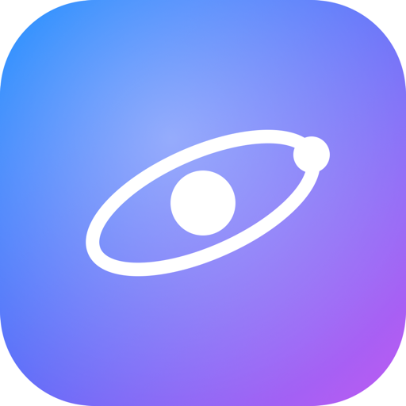

# hiaOS for iPhone

A **pocket operating system** for iPhone, delivered as an installable **PWA** and
composed around **Ollama Cloud**. It's the iOS reimagining of
[hiaOS](https://github.com/) — same liquid-glass soul, rebuilt for one hand and a
tall screen.

**▶︎ Live: https://hiaos-ios.github.io/iOS/** — open in Safari on iPhone and *Add to Home Screen*.

> _Repo: `hiaOS-iOS/iOS`. After the org is renamed to **hiaOS-dev** (GitHub → org Settings → General → Rename), the URL becomes `https://hiaos-dev.github.io/iOS/`. Export your data first (Settings → Data) — the new origin starts empty._

<p align="center"></p>

## What makes it iPhone-native

- **Vertical app stack** — open **one app full-screen**, or **two stacked
  vertically** (top / bottom). Each app declares whether it supports the split:
  splittable apps (hia, Ask, Notes, Translate, Calculator, Clock, Files) can share
  the screen; full-screen-only apps (Sketch, Settings) always take over. Opening a
  third app drops the oldest.
- **Left-edge taskbar** — hidden by default. **Swipe in from the left edge** (or
  tap the pull-handle) to reveal the **rail**. Tap the **EXPAND** button and the
  bar animates across to the other side of the screen into a full **launchpad** of
  every app, with a buttery spring + staggered tiles.
- **Ollama Cloud** — paste your API key on first launch, pick a model, done. No
  local server needed. Streams replies live.
- **Liquid glass everywhere** — animated wallpaper, floating colour blobs,
  `backdrop-filter` panels, safe-area aware, tuned for the notch and home
  indicator.
- **Installable** — Add to Home Screen and it runs full-screen as a standalone app
  with its own icon, offline shell (service worker), and portrait lock.

## Apps

| App | Split? | What it does |
|-----|:-----:|--------------|
| **hia** | ✅ | Multi-conversation streaming AI chat (drawer of chats, new/rename/delete, auto-titled) |
| **Ask** | ✅ | One-shot question → one answer |
| **Notes** | ✅ | Notes with AI Summarize / Improve / Expand |
| **Browser** | ✅ | Sandboxed web view + search, with “Open in Safari” for sites that refuse framing |
| **Translate** | ✅ | Translate text into 10 languages |
| **Calculator** | ✅ | Order-of-operations calc (no `eval`) |
| **Clock** | ✅ | Timer + stopwatch with laps & a beep |
| **Files** | ✅ | Local text files |
| **Sketch** | ⬜ | Finger drawing on canvas (full-screen) |
| **Studio** | ⬜ | Describe an app → hia **builds** it; then ask hia to **modify** it in place |
| **Settings** | ⬜ | Model/key, personality + creativity, accent + wallpaper, accessibility, app manager, data |

## Build & modify your own apps (Studio)

Open **Studio**, describe an app (“a tip calculator”, “a dice roller”), and hia
generates a complete sandboxed mini-app that joins your home screen, taskbar and
launchpad. Open it, tap the **✦ wand** in its title bar (or *Edit with AI*), and
describe a change — hia rewrites the **already-built** app in place. (The same
*modify an existing app* capability also ships in the desktop macOS hiaOS.)

## Conversations

**hia** keeps multiple conversations: tap the ☰ button for the drawer to switch,
start, rename (auto-titled from your first message) or delete chats.

## Backup & moving versions (export / import)

Storage is per-origin, so updating to a new web address (e.g. after the org
rename below) starts fresh. In **Settings → Data**, **Export my data** to a JSON
file and **Import** it into the new install to carry over your conversations,
notes, files, custom apps and preferences.

## Setup

1. Get an API key at **[ollama.com](https://ollama.com)** → *Settings → Keys*.
2. Open the app, paste the key, and type your **model id**. It's sent to the API
   **exactly as typed — nothing is appended.** The direct API uses bare ids like
   `gpt-oss:120b`, `deepseek-v3.1:671b`, `qwen3-coder:480b`; if your account
   expects the local cloud tag, type it yourself (e.g. `gpt-oss:20b-cloud`). The
   suggestion chips only pre-fill the field so you can edit it. The key stays on
   your device.

## Install on your iPhone

1. Open the deployed URL in **Safari**.
2. Tap **Share → Add to Home Screen**.
3. Launch it from the home screen — it opens full-screen, no browser chrome.

> A PWA must be served over **HTTPS** to install. The simplest route is **GitHub
> Pages** (Settings → Pages → deploy from `main`).

## Run locally

It's a fully static site — any static server works:

```bash
npx http-server . -p 5610 -c-1
# then open http://localhost:5610
```

## Important: CORS (you'll likely need the proxy)

The app calls `https://ollama.com/api/*` directly with your Bearer key — which is
exactly what Ollama's official client does. But Ollama's cloud API **does not
send CORS headers**, so a *browser* (Safari/Chrome) blocks the cross-origin call.
The Python/CLI examples work because they run server-side, where CORS doesn't
apply; a PWA runs in the browser, where it does.

**Fix:** deploy the tiny Cloudflare Worker in [`proxy/`](proxy/) (~2 minutes,
free), then set **Settings → Base URL** to your Worker URL. It forwards to
`ollama.com` and adds the CORS headers. Your key only passes through your own
Worker. See [`proxy/README.md`](proxy/README.md).

> If Ollama later enables CORS on `ollama.com`, the default Base URL will just
> work and the proxy becomes unnecessary.

## Tech

Vanilla JS, no build step, no dependencies. `js/ollama.js` is the API client,
`js/shell.js` is the stack manager + taskbar, `js/apps.js` is every app.

---

🤖 Generated with [Claude Code](https://claude.com/claude-code)
